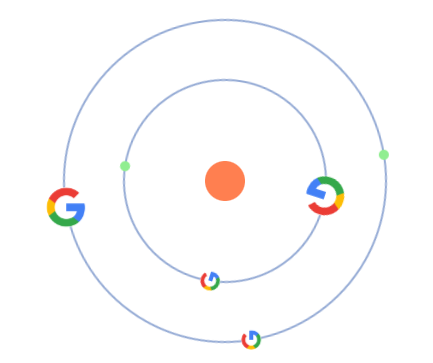

# React Orbits

> Create beautiful Orbit Components with React



[](https://www.npmjs.com/package/react-orbits) [](https://airbnb.io/javascript/react/)

## [DEMO](https://1pedro.github.io/react-orbits/?path=/story/example-reactorbits--multiple-orbits)

## Install

```bash
npm install --save react-orbits
```

## Usage

```tsx
import React, { Component } from 'react';

import ReactOrbits from 'react-orbits';
import 'react-orbits/dist/index.css';

class Example extends Component {
  render() {
    return (
      <ReactOrbits firstOrbitDiameter={200} marginBetweenOrbits={20}>
        <Orbit borderColor="red" spin="left">
          <Nucleus backgroundColor="red" size={20} />
          <Planet size={10} spin="left" />
        </Orbit>
        <Orbit animationSpeedInSeconds={2} borderColor="#95abd5" spin="right">
          <Planet backgroundColor="blue" size={10} />
          <Planet backgroundColor="green" shouldSpin={false} size={20} />
        </Orbit>
      </ReactOrbits>
    )
  }
}
```

## License

MIT © [1pedro](https://github.com/1pedro)
